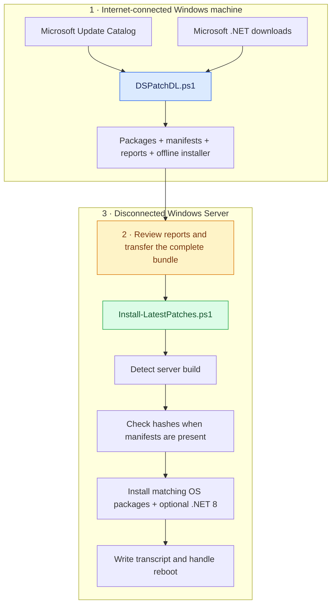

<div align="center">

# DLMSPatches

### Microsoft updates for disconnected Windows Servers

Prepare online. Transfer once. Patch at the dark site.

[](DSPatchDL.ps1)
[](#supported-targets)
[](LICENSE)

[Getting started](#getting-started) · [How it works](#how-it-works) · [Troubleshooting](#troubleshooting) · [Contributing](#contributing)

</div>

---

## What is DLMSPatches?

**DLMSPatches** prepares an offline bundle of selected Windows and .NET updates for Windows Server environments without internet access.

Run [`DSPatchDL.ps1`](DSPatchDL.ps1) on an internet-connected Windows machine. It downloads packages, records hashes and update details, and creates an installer that you transfer with the bundle to your disconnected server.

### Why use it?

- **Prepare updates centrally** for servers in isolated networks.
- **Keep OS packages separate** for Windows Server 2019, 2022 and 2025.
- **Review what was downloaded** through manifests and summary reports.
- **Carry the installer with the updates**, with OS detection and installation transcripts.

The project selects Windows cumulative security updates, .NET Framework updates and the .NET 8 Hosting Bundle. It does not inventory or patch every Microsoft product, application or server vulnerability.

## Contents

- [How it works](#how-it-works)
- [Supported targets](#supported-targets)
- [Getting started](#getting-started)
- [Command options](#command-options)
- [Bundle layout](#bundle-layout)
- [Reports and verification](#reports-and-verification)
- [Current limitations](#current-limitations)
- [Troubleshooting](#troubleshooting)
- [Contributing](#contributing)
- [References](#references)
- [License](#license)

## How it works



The downloader uses [MSCatalogLTS](https://github.com/Marco-online/MSCatalogLTS) to search and download from Microsoft Update Catalog. Matching updates are sorted by Catalog date; preview updates are excluded.

## Supported targets

These are the targets recognized by the current installer; this table is not an end-to-end test certification.

| Windows Server | OS build | Package folder | Framework base installer bundled |
| --- | --- | --- | --- |
| 2019 | `17763` | `windows 2019` | .NET Framework 4.8 |
| 2022 | `20348` | `windows 2022` | .NET Framework 4.8.1 |
| 2025 | `26100` | `windows 2025` | .NET Framework 4.8.1 |

The shared `common patchs` folder contains the .NET 8 Hosting Bundle. **.NET Framework 4.x and .NET 8 are separate products** with separate servicing requirements.

Server 2025 already includes .NET Framework 4.8.1; a bundled base installer does not imply an upgrade is needed. See [Microsoft's Framework installation guidance](https://learn.microsoft.com/en-us/dotnet/framework/install/on-windows-and-server).

## Getting started

### 1. Get the script

Clone the repository:

```powershell
git clone https://github.com/AmroGaber/DLMSPatches.git
Set-Location .\DLMSPatches
```

Or [download the repository ZIP](https://github.com/AmroGaber/DLMSPatches/archive/refs/heads/main.zip), extract it and open PowerShell in the extracted directory.

### 2. Prepare on a connected Windows machine

You need:

- Windows PowerShell on a Windows machine.
- Internet access to PowerShell Gallery, Microsoft Update Catalog and Microsoft .NET downloads.
- Enough free space for packages for all three server versions.
- Permission to run the script under your organization's PowerShell policy.

The script's usage notes recommend an Administrator PowerShell session. The downloader installs the `MSCatalogLTS` module in the current user's scope if it is missing, then imports it.

```powershell
.\DSPatchDL.ps1
```

The bundle is created in **`Latest patches` beside the script**, regardless of the shell's working directory.

> [!IMPORTANT]
> Review `Patch-Summary.txt` and any `Patch-Failures.csv` before transfer. The downloader continues after some failures, so its final “COMPLETED” heading does not guarantee a complete bundle. Use a fresh script directory for a new bundle to avoid mixing old and new packages.

### 3. Transfer the bundle

Copy the **complete `Latest patches` folder**, including the generated installer, manifests, reports and package folders, through your approved transfer process.

### 4. Install on the disconnected server

Open PowerShell **as Administrator**, change to the copied bundle directory and run:

```powershell
.\Install-LatestPatches.ps1 -NoReboot
```

To omit the .NET 8 Hosting Bundle:

```powershell
.\Install-LatestPatches.ps1 -NoReboot -SkipDotNet8
```

The installer rejects Windows clients and unsupported server builds. It invokes WUSA for `.msu` files, DISM for `.cab` files and quiet installation switches for bundled executables.

> [!WARNING]
> Without `-NoReboot`, the installer schedules a restart in **60 seconds** when a handled process exit code indicates that a reboot is required. `-NoReboot` prevents that scheduled restart; a restart may still be needed to complete servicing.

Review the transcript and confirm the installed update state after any required restart.

## Command options

| Script | Option | Current behavior |
| --- | --- | --- |
| `DSPatchDL.ps1` | No options | Prepare packages, manifests, reports and installer. |
| `DSPatchDL.ps1` | `-ForceRefresh` | Re-download files handled by `Download-File` even when already present. Does not clean old packages or control Catalog caching. |
| `Install-LatestPatches.ps1` | `-NoReboot` | Prevent the installer's automatic scheduled restart. |
| `Install-LatestPatches.ps1` | `-SkipDotNet8` | Skip execution of the shared .NET 8 Hosting Bundle. Common manifest checks still run if that manifest exists. |

## Bundle layout

Folder names below match the script, including `common patchs`.

```text
Latest patches/
├── Install-LatestPatches.ps1
├── Patch-Summary.txt
├── Patch-Summary.csv
├── Patch-Failures.csv          # Created when download sections fail
├── README.txt
├── common patchs/
│   ├── dotnet-hosting-<version>-win.exe
│   └── Manifest.csv
├── windows 2019/
│   ├── Windows and .NET Framework update packages
│   ├── NDP48-x86-x64-AllOS-ENU.exe
│   └── Manifest.csv
├── windows 2022/
│   ├── Windows and .NET Framework update packages
│   ├── NDP481-x86-x64-AllOS-ENU.exe
│   └── Manifest.csv
└── windows 2025/
    ├── Windows and .NET Framework update packages
    ├── NDP481-x86-x64-AllOS-ENU.exe
    └── Manifest.csv
```

The installer creates a `Logs/` directory at the bundle root when it runs.

## Reports and verification

| Output | Purpose |
| --- | --- |
| `Manifest.csv` | Per-folder package names, SHA256 hashes and component metadata. Common and OS manifest schemas differ. |
| `Patch-Summary.txt` | Readable download summary and failure details. |
| `Patch-Summary.csv` | Structured summary for review or reporting. |
| `Patch-Failures.csv` | Download sections that failed during the run. An old report may remain after a subsequent successful run. |
| `Logs/OfflinePatch-*.log` | Transcript from the disconnected-server installer. |

The downloader requires the .NET 8 executable to have a valid Authenticode signature and a signer subject matching Microsoft. Other package signature statuses are recorded but are not enforced.

The installer compares listed files against SHA256 hashes **when manifests are present**. Hashes help detect changes relative to a manifest; they do not authenticate a manifest that can be replaced together with its files.

## Current limitations

The current implementation needs further validation and hardening before unattended production deployment.

| Area | Limitation |
| --- | --- |
| Manifest enforcement | Missing manifests do not block installation. File discovery can include packages and executables absent from manifests. |
| Repeat downloads | Persistent folders retain old packages. A Catalog fallback can attribute existing files to the wrong update; older Hosting Bundles remain discoverable. |
| Failure handling | Several installation failures produce warnings and allow a final completion message. Incomplete downloads do not produce a final nonzero exit status. |
| Framework sequencing | Framework cumulative updates run before the base Framework installer. Applicability, installed Framework release and reboot prerequisites need explicit handling. |
| Server 2025 checkpoints | Alphabetical file sorting does not establish the prerequisite installation sequence. Verify the target KB's checkpoint requirements. |
| Module bootstrap | The downloader can persistently mark PowerShell Gallery as Trusted and imports an unpinned module version. |

For Server 2025, Microsoft documents required checkpoint packages and supported sequencing/DISM approaches in [checkpoint cumulative update guidance](https://learn.microsoft.com/en-us/windows/deployment/update/catalog-checkpoint-cumulative-updates).

## Troubleshooting

| Symptom | What to check |
| --- | --- |
| Module installation fails | PowerShell Gallery connectivity, proxy/TLS configuration and module installation permissions. |
| No applicable Catalog update is found | The failed component in the reports, Catalog title/classification changes and the configured search/filter. |
| Missing file or hash mismatch | Bundle completeness and trusted source copies. Rebuild or re-transfer the affected bundle; do not bypass the check. |
| An update fails or is not applicable | Transcript, process exit code, OS build, installed Framework release and the target KB prerequisites. |
| Server 2025 cumulative update fails | Whether required checkpoints are present and installed using Microsoft's documented method. |
| Script execution is blocked | Your organization's PowerShell execution policy and script approval/signing process. |

A transcript or completion message alone does not confirm that every update installed successfully.

## Contributing

Bug reports, documentation improvements and pull requests are welcome.

For a useful [issue](https://github.com/AmroGaber/DLMSPatches/issues), include:

- Server version/build and PowerShell version.
- The command used and the affected component or KB.
- Relevant report/transcript excerpts and process exit codes.
- Whether the bundle was fresh or reused, and steps to reproduce.

Remove hostnames, internal paths and other sensitive information before sharing logs.

For servicing changes, describe validation on the affected server version. Particularly useful contributions include manifest enforcement, accurate failure reporting, clean staging, Framework applicability and checkpoint handling.

## References

- [Microsoft Update Catalog](https://www.catalog.update.microsoft.com/)
- [MSCatalogLTS source](https://github.com/Marco-online/MSCatalogLTS)
- [Microsoft checkpoint cumulative updates](https://learn.microsoft.com/en-us/windows/deployment/update/catalog-checkpoint-cumulative-updates)
- [Microsoft .NET Framework installation](https://learn.microsoft.com/en-us/dotnet/framework/install/on-windows-and-server)

## License

Released under the [MIT License](LICENSE). Copyright © 2026 Amr Gaber.

DLMSPatches is an independent project and is not affiliated with Microsoft.
