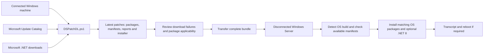

# DLMSPatches

DLMSPatches prepares Windows and .NET update packages on an internet-connected Windows machine for transfer to disconnected (“dark-site”) servers. `DSPatchDL.ps1` downloads packages and generates a separate offline installer.



## Intended scope

| Target | Detected build | Bundle folder | Framework base installer bundled |
| --- | --- | --- | --- |
| Windows Server 2019 | 17763 | `windows 2019` | .NET Framework 4.8 |
| Windows Server 2022 | 20348 | `windows 2022` | .NET Framework 4.8.1 |
| Windows Server 2025 | 26100 | `windows 2025` | .NET Framework 4.8.1 |
| Shared component | All three | `common patchs` | .NET 8 Hosting Bundle |

The downloader searches for the newest matching security-classified cumulative updates and excludes previews. .NET Framework and modern .NET are separate components. This is a selected Windows/.NET bundle, not a complete inventory of every Microsoft product or server vulnerability.

## Prepare the bundle

Use an internet-connected Windows machine with PowerShell, access to PowerShell Gallery and Microsoft download endpoints, and sufficient disk space. The script installs/imports `MSCatalogLTS` for Catalog access. Its bootstrap currently sets PowerShell Gallery to Trusted when installing the module.

From the directory containing the script:

```powershell
.\DSPatchDL.ps1
# Re-download files handled by Download-File even when already present:
.\DSPatchDL.ps1 -ForceRefresh
```

The output is created beside the script, in `Latest patches`. Review `Patch-Summary.txt`, `Patch-Summary.csv`, and `Patch-Failures.csv` when present. A completed run can contain failed sections; inspect the reports before transfer. `-ForceRefresh` does not clean the bundle or govern Catalog caching.

```text
Latest patches/
  Install-LatestPatches.ps1
  Patch-Summary.txt
  Patch-Summary.csv
  Patch-Failures.csv       (when download sections fail)
  README.txt
  common patchs/          (.NET 8 Hosting Bundle and Manifest.csv)
  windows 2019/           (OS/.NET packages and Manifest.csv)
  windows 2022/           (OS/.NET packages and Manifest.csv)
  windows 2025/           (OS/.NET packages and Manifest.csv)
```

## Use on a disconnected server

Copy the complete bundle and open PowerShell as Administrator in its root directory. For an initial controlled run:

```powershell
.\Install-LatestPatches.ps1 -NoReboot
# Omit .NET 8 when the server does not require it:
.\Install-LatestPatches.ps1 -NoReboot -SkipDotNet8
```

The generated installer rejects Windows clients and unsupported builds. It uses WUSA for MSU files, DISM for CAB files, and quiet switches for bundled executables. Logs are written to `Logs`. Without `-NoReboot`, it schedules a restart in 60 seconds if a handled installer exit code indicates reboot is required.

## Current limitations to address

- **Manifest enforcement:** hash checks run only when a manifest exists. Package discovery also includes files absent from manifests. Missing manifests and unlisted executables/packages should block installation.
- **Failure reporting:** several non-success process exit codes produce warnings, after which the installer can still report completion. Download failures likewise do not produce a final nonzero exit status.
- **Repeat runs:** downloads share persistent folders. Existing packages can be attributed to the wrong Catalog update by the fallback logic, and older Hosting Bundles remain discoverable. Use isolated staging and an explicit package inventory.
- **Framework sequencing:** Framework cumulative updates run before the base Framework installer. Select updates for the intended Framework version, upgrade the base only when needed, and account for prerequisite/reboot boundaries. Server 2025 already includes Framework 4.8.1.
- **Server 2025 checkpoints:** filename sorting does not establish the documented prerequisite sequence. Verify the target KB prerequisites and stage the correct checkpoint files; use Microsoft's documented sequence or supported DISM handling.
- **Authenticity:** the .NET 8 EXE is required to have a valid signature with a Microsoft-matching signer subject. Other package signatures are recorded but not enforced. Local hashes detect changes against the supplied manifest; they do not authenticate a manifest that can be replaced with the files.

Before production use, validate clean and previously patched Server 2019/2022/2025 machines, repeat downloads, missing/tampered manifests, process failures, and checkpoint prerequisites. PowerShell syntax validation alone does not validate successful servicing.

## References

- [Source script](https://github.com/AmroGaber/DLMSPatches/blob/main/DSPatchDL.ps1)
- [MSCatalogLTS module](https://github.com/Marco-online/MSCatalogLTS)
- [Microsoft checkpoint cumulative update guidance](https://learn.microsoft.com/en-us/windows/deployment/update/catalog-checkpoint-cumulative-updates)
- [Microsoft .NET Framework installation guidance](https://learn.microsoft.com/en-us/dotnet/framework/install/on-windows-and-server)

## License

See [LICENSE](LICENSE).
